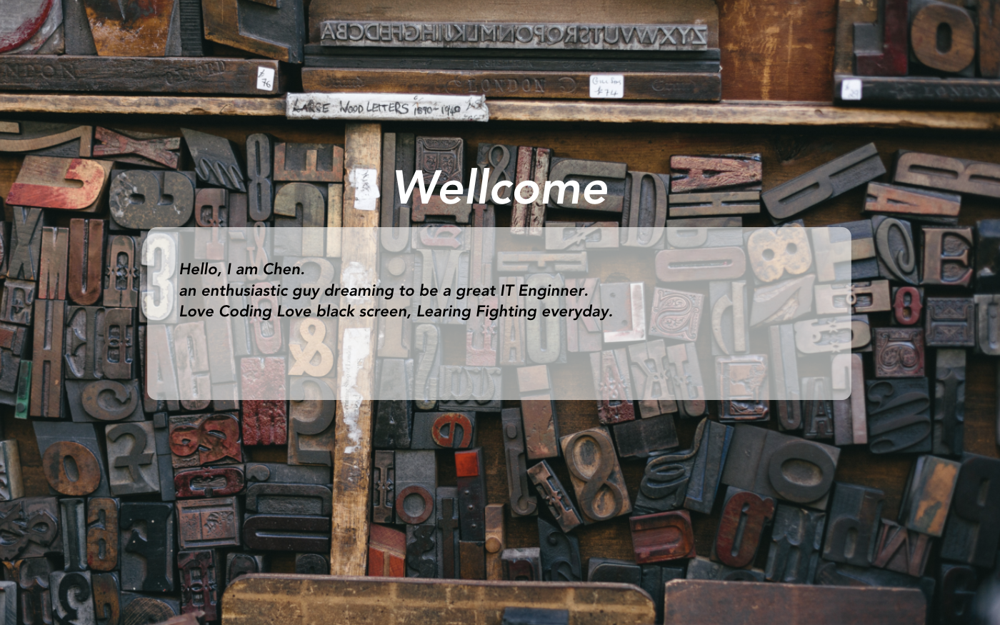
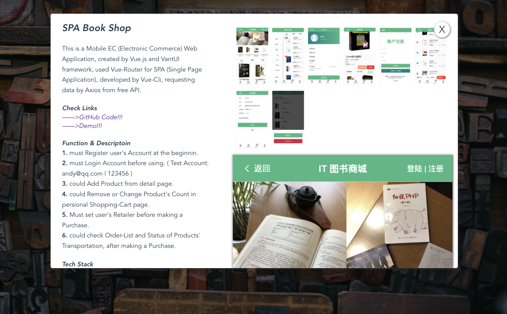
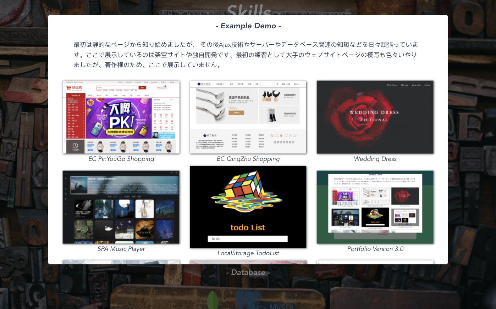
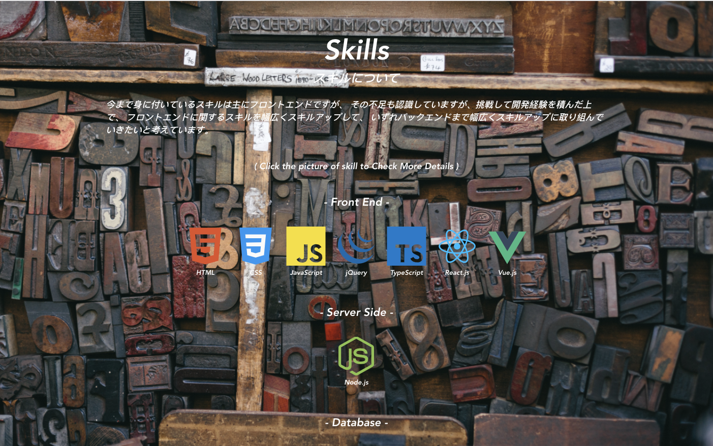

# SPA - Portfolio

This is my Portfolio, a Responsive SPA (Single Page Application) 

Created by Vue.js + Vue-Router, developed by Vue-Cli, rendering data to templates by Local JSON files.


## Links
https://blaxberry.github.io


## Tech Stack

- HTML5 + CSS3

- Vue.js

- Vue-Cli

- Vue-Router

- Webpack

- Less

- MediaQuery

---

images





---

## Function & Descriptoin

Could check more details of my Skills and Works, by clicking picture or link button of each one.


## Project setup
```
npm install
```
```
npm run serve
```
```
npm run build
```
```
npm run lint
```


